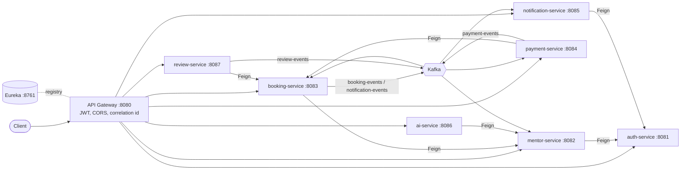

# EduMentor

AI-powered counselling and mentor-booking platform for **KCET, JEE and NEET** students.
Students book paid sessions with **verified** mentors who are currently studying in engineering or medical
colleges. This repository contains the **backend** (9 Spring Boot services).

> Built as a portfolio project to demonstrate microservice design: data ownership per service, event-driven
> consistency (saga + outbox), concurrency control, idempotent payments and AI-assisted search.

## Highlights

- **Microservices** with API Gateway, Eureka discovery, OpenFeign and Kafka. One database per service.
- **Concurrency-safe booking**: pessimistic lock + `@Version` + unique-index guard; temporary slot holds with expiry.
- **Saga with transactional outbox**: payment success, booking confirmation, meeting link, notification; refunds
  when a payment cannot be honoured.
- **Payments**: provider abstraction (mock/Stripe), `Idempotency-Key`, HMAC-verified webhooks, replay protection,
  webhook de-duplication.
- **AI recommendations**: Spring AI embeddings, pgvector cosine search, fact-based explanations. Runs with a
  deterministic mock provider, or OpenAI via a profile.
- **Security**: stateless JWT, BCrypt, RBAC at gateway and service level, header-spoofing protection.
- **Resilience**: circuit breaker, time limiter, retry, fail-closed fallbacks, Kafka retry + dead-letter topics.
- **Observability**: correlation IDs across HTTP and Kafka, Actuator health, structured logging without secrets.

## Architecture



| Service | Port | Datastore | Responsibility |
|---|---|---|---|
| service-registry | 8761 | - | Eureka service discovery |
| api-gateway | 8080 | - | Routing, central JWT validation, CORS, correlation ID |
| auth-service | 8081 | MySQL `edumentor_auth` | Registration, login, JWT, users |
| mentor-service | 8082 | MySQL `edumentor_mentor` | Mentor profiles, verification workflow, search, ratings |
| booking-service | 8083 | MySQL `edumentor_booking` | Slots, temporary holds, bookings, saga steps, reminders |
| payment-service | 8084 | MySQL `edumentor_payment` | Payments, idempotency, webhooks, refunds |
| notification-service | 8085 | MySQL `edumentor_notification` | Event-driven emails and history |
| ai-service | 8086 | Postgres + pgvector | Mentor embeddings and recommendations |
| review-service | 8087 | MySQL `edumentor_review` | Reviews and rating aggregates |


Failure paths: `PAYMENT_FAILED` cancels the booking and releases the slot. A payment that succeeds after the hold
expired makes booking-service emit `BOOKING_PAYMENT_REJECTED`, and payment-service refunds it.

### Mentor verification

`PENDING` -> admin review -> `APPROVED` or `REJECTED`. Only approved mentors are searchable, can create slots and
are indexed for recommendations. Editing credentials sends an approved mentor back to `PENDING`.

## Tech stack

Java 21, Spring Boot 3.3 (ai-service: 3.4 + Spring AI 1.0), Spring Security 6, Spring Data JPA, Spring Cloud
Gateway/Eureka/OpenFeign, Resilience4j, Apache Kafka (KRaft), MySQL 8, PostgreSQL + pgvector, jjwt, springdoc
OpenAPI, Lombok, JUnit 5, Mockito, MockMvc, Testcontainers, Docker, Docker Compose, GitHub Actions.

## Run it

Requirements: Docker Desktop with about 6 GB of memory, JDK 21 and Maven (only for building outside Docker).

```bash
git clone https://github.com/YOUR_USERNAME/edumentor.git
cd edumentor
cp .env.example .env        # then edit: JWT_SECRET (32+ chars), DB_PASSWORD, PG_PASSWORD, ADMIN_PASSWORD
docker compose up --build -d
docker compose ps
```

- Gateway: http://localhost:8080 (the only entry point to the services)
- Eureka dashboard: http://localhost:8761
- A bootstrap admin is created from `ADMIN_EMAIL` / `ADMIN_PASSWORD`.

> The compose stack runs the `dev` profile: mock payments, mock email, mock meeting links, a dev payment
> simulator and a dev-only internal API key. It is a demo stack, not a production deployment.

### Try the main flow

1. `POST /api/auth/register` as a `MENTOR` and as a `STUDENT`; log in to get JWTs.
2. Mentor: `POST /api/mentors/me`, then `POST /api/mentors/me/verification`.
3. Admin: `POST /api/mentors/admin/{id}/approve`, then `POST /api/ai/admin/reindex`.
4. Mentor: `POST /api/bookings/slots`.
5. Student: `POST /api/ai/recommendations`, `POST /api/bookings`, `POST /api/payments` (with `Idempotency-Key`).
6. Admin: `POST /api/payments/dev/{paymentId}/simulate?outcome=SUCCESS` delivers a signed mock webhook.
7. The booking becomes `CONFIRMED` with a meeting link, and notifications are logged by notification-service.

## Configuration

| Variable | Purpose |
|---|---|
| `JWT_SECRET` | HMAC secret shared by gateway and services (32+ bytes, no default) |
| `DB_PASSWORD`, `PG_PASSWORD` | Database passwords |
| `ADMIN_EMAIL`, `ADMIN_PASSWORD` | Bootstrap admin account |
| `PAYMENT_PROVIDER` | `mock` (default) or `stripe` (+ `STRIPE_SECRET_KEY`, `STRIPE_WEBHOOK_SECRET`) |
| `SPRING_PROFILES_ACTIVE=dev,openai` + `OPENAI_API_KEY` | Use OpenAI in ai-service |
| `MEETING_PROVIDER` | `mock` or `google` (+ Google OAuth variables) |
| `HOLD_DURATION` | Slot hold length, ISO-8601 (default `PT10M`) |

No secrets are committed. `.env` is git-ignored.

## Testing

```bash
cd services/<service> && mvn clean verify
```

200+ tests: unit (Mockito), controller and full-stack (MockMvc with the real security chain), concurrency tests
(parallel slot holds, parallel duplicate webhooks, parallel reviews) and pgvector integration tests via
Testcontainers (skipped when Docker is unavailable). Tests need no external credentials.

## API documentation

Each service exposes Swagger UI at `/swagger-ui.html` when run directly. In the compose stack only the gateway
is published, so run a service locally to use Swagger. Endpoint reference: see [docs/api](docs/api).

## Design decisions and known limitations

- **Database per service**, no cross-service foreign keys; services reference each other by id.
- **At-least-once delivery** with idempotent consumers, rather than distributed transactions.
- The **outbox relay assumes one instance per service**; scaling out needs `SELECT ... FOR UPDATE SKIP LOCKED`.
- The gateway validates JWT signature and expiry only; a disabled user's token stays valid until it expires.
  Services also validate the token.
- JWT uses a shared HMAC secret. Asymmetric keys (JWKS) would be better for production.
- Mentor proof upload stores a **reference only**; S3 upload is not implemented.
- Stripe, OpenAI and Google Meet implementations are written but were developed against mocks; they have not
  been exercised against live accounts.
- No distributed tracing backend (correlation IDs only), no Kubernetes manifests, no rate limiting beyond the
  AI endpoint.
- Hold expiry, meeting creation and reminders are best-effort; a failed meeting creation confirms the booking
  without a link.


